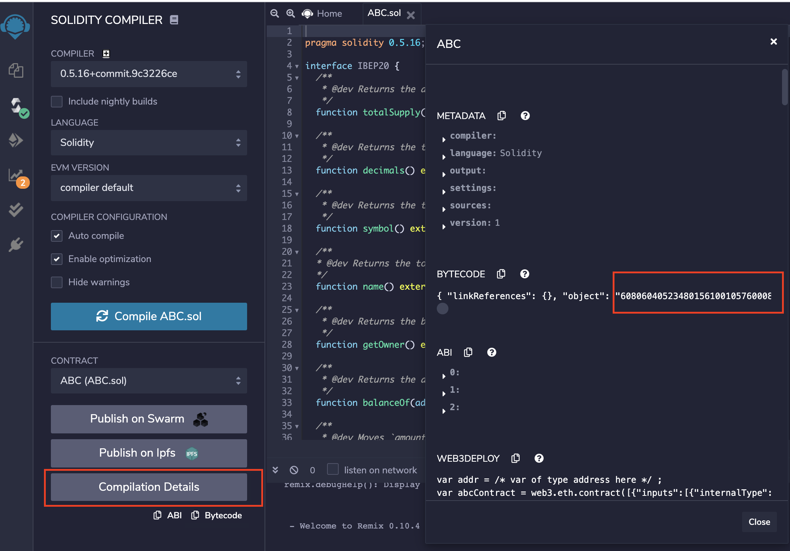
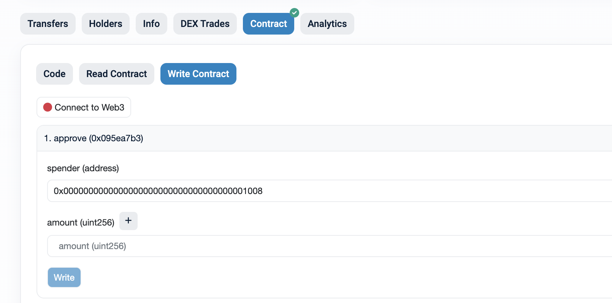
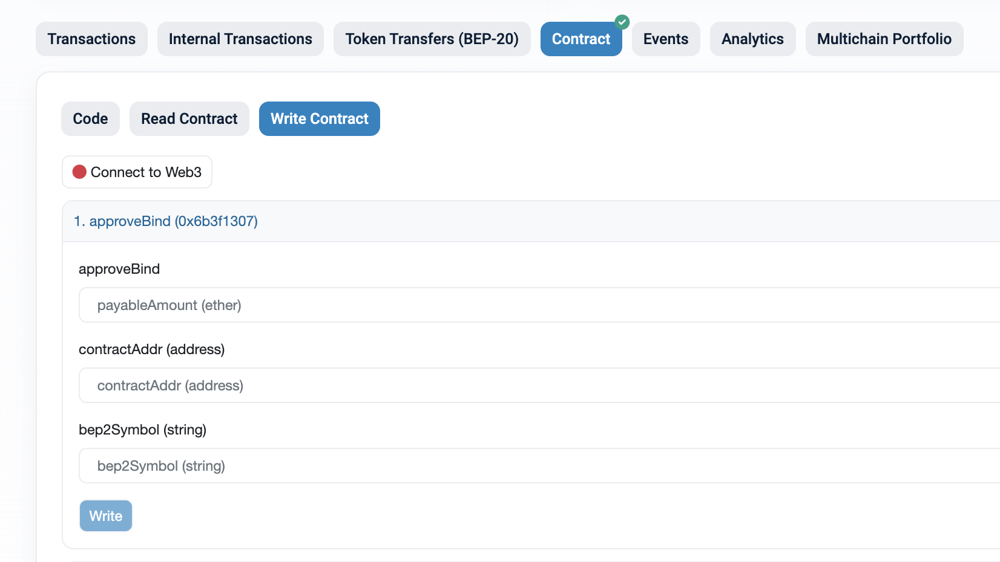

# token-bind-tool

Tool to bind BEP2 tokens and BEP20 tokens.

## Token Bind Mechanism


Cross-chain communication is the foundation of Binance Smart Chain (BSC), which enables tokens to move between the
Beacon Chain (BC) and BSC. After token binding, some tokens are locked on both BSC and BC to facilitate cross-chain
transfers.

When transferring tokens between BSC and BC, the transfer-out blockchain locks the amount from the source owner
addresses into a system-controlled address/contract. The transfer-in blockchain then unlocks the amount from the
system-controlled address/contract and sends it to the target addresses.

For more detailed information, please refer to the [document](https://docs.bnbchain.org/docs/circulation-model/).

## Compile

Compile token bind tool:

```shell script
make build
```

## Preparation for binding tokens

1. Generate a temp account (Deploy contract on BNB Smart Chain):
    ```shell script
    ./build/token-bind-tool initKey --network-type {testnet/mainnet}
    ```
   Example response:
    ```text
    Temp account: 0xde9Aa1d632b48d881B50528FC524C88474Ec8809, Explorer url: https://bscscan.com/address/0xde9Aa1d632b48d881B50528FC524C88474Ec8809
    ```

2. Transfer 1 BNB to the temp account.

   2.1 Cross chain transfer
   ```shell script
    bnbcli bridge transfer-out --expire-time `expr $(date +%s) + 3600` \
    --chain-id Binance-Chain-Tigris --from {keyName} --node http://dataseed4.binance.org:80 \
    --to {temp account address} --amount 100000000:BNB
    ```
   Example command:
   ```shell script
   bnbcli bridge transfer-out --expire-time `expr $(date +%s) + 3600` \
   --chain-id Binance-Chain-Tigris --from bep2TokenIssuer --node http://dataseed4.binance.org:80 \
   --to 0xde9Aa1d632b48d881B50528FC524C88474Ec8809 --amount 100000000:BNB
   ```

   2.2 You can also transfer BNB from another BNB Smart Chain account
   with [Metamask](https://docs.binance.org/smart-chain/wallet/metamask.html).

## Bind BEP2 token with BEP20 token

### Case 1

Suppose you have already issued a BEP2 token, and you want to deploy a BEP20 token and bind it with the existing BEP2
token:

1. Import bep2 token owner key (Send bind transaction on BNB Chain):

   1.1 From ledger: connect ledger to your computer and open BNB Chain App
    ```shell script
    bnbcli keys add bep2TokenIssuer --ledger --index {your ledger key index}
    ```
   1.2 From mnemonic:
    ```shell script
    bnbcli keys add bep2TokenIssuer --recover
    ```

2. Prepare BEP20 contract code

   2.1 You can refer
   to [BEP20 Template](https://github.com/binance-chain/bsc-genesis-contract/blob/master/contracts/bep20_template/BEP20Token.template)
   and modify it according to your own requirements.

   **NOTE 1:** Ensure the BEP20 symbol is identical to the prefix of a BEP2 token symbol. Suppose a BEP2 token symbol
   is `ABC-123`, then the BEP20 symbol must be `ABC`.

   **NOTE 2:** Ensure the the BEP20 contract implement the `getOwner` interface, and the owner have more than
   ${peggy-amount} tokens. ${peggy-amount} is the maximum amount of BEP2 tokens that can be transferred to the BSC
   network.

   **NOTE 3:** Ensure the total supply equals to the BEP2 token total supply. As we know, the decimals of BEP2 tokens
   are 8, if the BEP20 decimal is 18, then the BEP20 total supply must be `BEP2_total_supply*10^10`.

   **NOTE 4:** If your BEP2 token is mintable, then you'd better implement `mint` in BEP20 contract. Otherwise, you'd
   better remove `mint` in BEP20 contract.

   2.2 Compile your contract with [Remix](https://remix.ethereum.org) and get contract byte code:
   

4. Edit `script/contract.json` to add contract byte code:

    ```json
    {
      "contract_data": ""
    }
    ```
   Fill contract byte code to `contract_data`

5. Deploy contract, bind and transfer ownership:

    ```shell script
    ./script/bind.sh {mainnet/testnet} {bep2TokenIssuerKeyName} {password, for ledger key, use empty string: ""} {peggy amount} {bep2 token symbol} {token owner} {path to bnbcli or tbnbcli}
    ```

Here `{peggy amount}` is the number of tokens that circulating on BSC. In this case, it should be `0`.

   Example command:
    ```shell script
    ./script/bind.sh testnet bep2TokenIssuer "12345678" 0 ABC-D9B 0xaa25Aa7a19f9c426E07dee59b12f944f4d9f1DD3 $HOME/go/bin/tbnbcli
    ```

### Case 2

Suppose you have already issued BEP2 token, deployed BEP20 contract.

To bind an existing BEP2 token and a BEP20 token, the following requirements must be met:

- The BEP20 symbol must have **2 to 8 characters**.
- The BEP20 symbol must be the **same as the BEP2 symbol**, except for the `-` and the suffix (e.g., `ABC` for BEP20
  and `ABC-B2A` for BEP2).
- The total supply of BEP20 must be **less than or equal to** 9000000000000000000. This is the maximum allowed supply
  for BEP20 tokens.
- The total supply of BEP20 must be **proportional** to the total supply of BEP2, taking into account the **different
  decimals** of the two tokens.
- The BEP20 contract must **implement** the `getOwner` function, which returns the address of the contract owner. This
  function is part of the BEP20 standard.

To check whether we can bind the BEP2 token and BEP20 token, please run this command:

```shell script
./build/token-bind-tool preCheck --bep2-symbol {bep2 symbol} --bep20-contract-addr {bep20 contract address}
```

If the check does not pass, please contact BNB chain support [@zhaojimmy](https://t.me/zhaojimmy) in Telegram for help.
Otherwise, you can move on to bind the tokens.

Firstly, you should send a bind transaction to Beacon chain with the following command:

```shell script
bnbcli bridge bind --symbol {bep2 symbol} --amount {peggy amount} --expire-time `expr $(date +%s) + 604800` \
--contract-decimals {bep20 contract decimals} --from {bep2TokenIssuerKeyName} --chain-id $chainId --contract-address {bep20 contract address} \
--node {bc noe url}
```

Here `{peggy amount}` is the number of tokens that circulating on BSC. The owner of this BEP2 token must hold 
more than `{peggy amount}` tokens for it will be locked on the BC side. Meanwhile, the owner of the BEP20 token must hold 
more than `{total supply} - {peggy amount}` tokens on the BSC side.

Example command:

```shell script
bnbcli bridge bind --symbol ABC-123 --amount 6000000000000000 --expire-time 1597585851 \
--contract-decimals 18 --from owner --chain-id Binance-Chain-Tigris --contract-address 0xee3de9d0640ab4342bf83fe2897201543924a324 --node https://dataseed1.bnbchain.org:443
```

Then you can approve the bind.

To approve the bind using Ledger you can follow the steps below.
Please make sure that your Ledger can unlock the token owner of the BEP20 contract.

1. Connect ledger to your machine and open Ethereum app.
2. Execute this command to approve bind:

```shell script
./build/token-bind-tool approveBindFromLedger --bep2-symbol {bep2 symbol} --bep20-contract-addr {bep20 contract address} \
--ledger-account-index {ledger key index} --peggy-amount {peggy amount} --network-type {mainnet/testnet}
```

If you are not using a Leger, you can use your Web3 wallets.

1. Approve BSC system contract `TokenManager` to spend your BEP20 tokens.

* Open your contract on BSCScan https://bscscan.com/token/{bep20_contract_address}#writeContract
* Find `approve` contract call, set `spender` to `0x0000000000000000000000000000000000001008` and `amount` to 4e25
* Connect your Web3 wallet and send the `approve` transaction



2. Call `ApproveBind` of `TokenManager` contract to approve the bind.

* Open `TokenHub` contract on BSCScan https://bscscan.com/token/0x0000000000000000000000000000000000001008#writeContract
* Find `approveBind` contract call, set `contractAddr` to your BEP20 token contract address and `bep2Symbol` to your
  BEP2 token symbol
* Connect your Web3 wallet and send the `approveBind` transaction



### Case 3

Suppose you want to deploy a BEP20 contract and transfer all tokens and ownership to your owner account, then you can
try this command:

```shell script
./build/token-bind-tool deployBEP20ContractTransferTotalSupplyAndOwnership --bep20-owner {bep20 owner} \
--config-path {contract byte code path, refer to `script/contract.json`} --network-type {mainnet/testnet}
```

## Refund rest BNB on a temp account

```shell script
./build/token-bind-tool refundRestBNB --network-type {mainnet/testnet} --recipient {bsc account}
```
